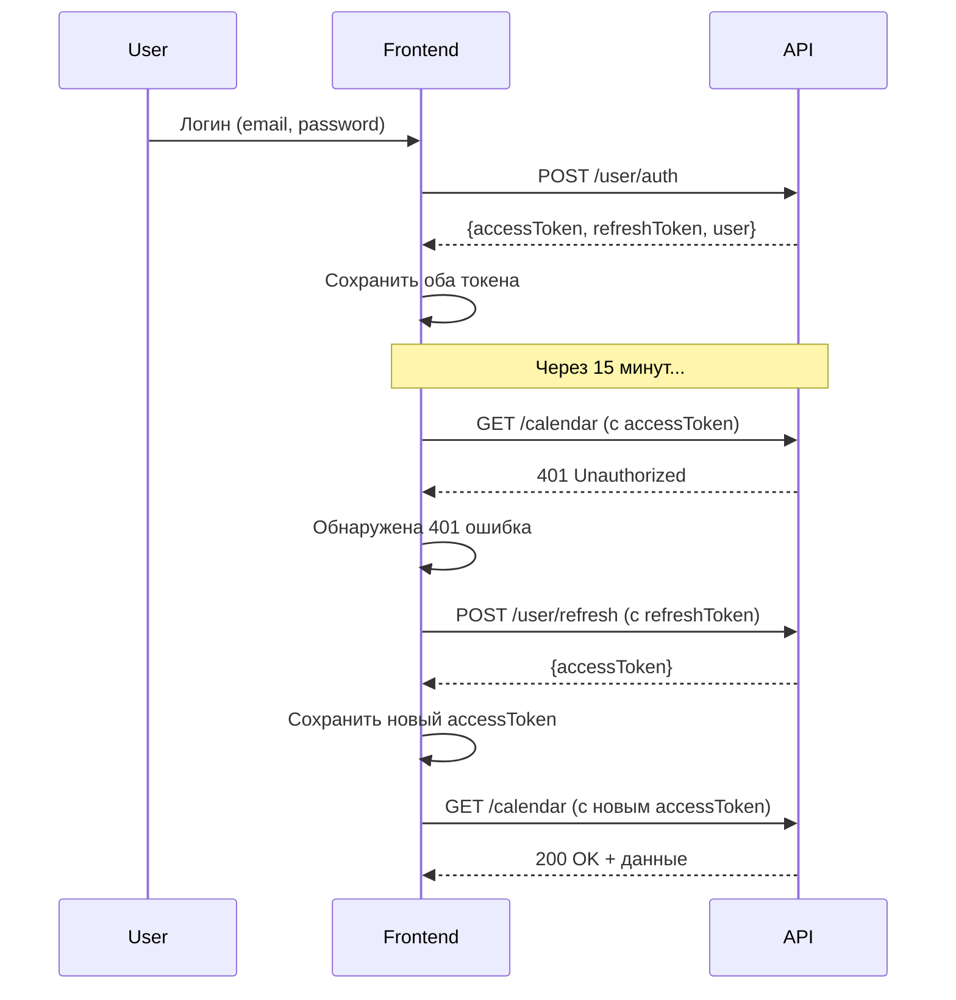

# Система Access/Refresh токенов

## Проблема
При использовании обычных токенов с долгим сроком действия возникает 401 ошибка, даже если токен есть в localStorage. Это связано с тем, что бэкенд теперь использует **систему с двумя токенами**: access и refresh.

---

## 🔐 Как работает система токенов

### Access Token (Короткоживущий)
- **Срок жизни:** 15-30 минут (обычно)
- **Назначение:** Используется для авторизации запросов к API
- **Хранение:** localStorage, cookies
- **Ключи хранения:** `auth_token`, `access_token`, cookie `token`

### Refresh Token (Долгоживущий)
- **Срок жизни:** 7-30 дней (обычно)
- **Назначение:** Используется для получения нового access token
- **Хранение:** localStorage
- **Ключ хранения:** `refresh_token`

---

## ✅ Что было реализовано

### 1. **Сохранение обоих токенов при логине** (SimpleAuthContext.tsx)

```typescript
// При успешном логине сохраняем оба токена
const accessToken = result.accessToken || result.token;
const refreshToken = result.refreshToken;

// Сохраняем access token
localStorage.setItem('auth_token', accessToken);
localStorage.setItem('access_token', accessToken);

// Сохраняем refresh token
if (refreshToken) {
  localStorage.setItem('refresh_token', refreshToken);
}
```

**Изменения:**
- `src/contexts/SimpleAuthContext.tsx:192-215`

---

### 2. **Автоматическое обновление токена** (http.ts)

При получении ошибки 401 (Unauthorized), система автоматически:

1. Проверяет наличие refresh token
2. Отправляет запрос на `/user/refresh` с refresh token
3. Получает новый access token
4. Сохраняет новый access token
5. Повторяет оригинальный запрос с новым токеном

**Код:**
```typescript
// Response interceptor для обработки 401
$apiSecondary.interceptors.response.use(
  (response) => response,
  async (error) => {
    if (error.response?.status === 401 && !originalRequest._retry) {
      // Пытаемся обновить токен
      const newAccessToken = await refreshAccessToken();

      if (newAccessToken) {
        // Повторяем запрос с новым токеном
        return $apiSecondary(originalRequest);
      } else {
        // Не удалось обновить - выходим
        localStorage.clear();
        window.location.href = '/login';
      }
    }
  }
);
```

**Изменения:**
- `src/API/http.ts:59-222`

---

### 3. **Очередь запросов при обновлении токена**

Если несколько запросов одновременно получили 401, система:
- Обновляет токен **один раз**
- Ставит остальные запросы в очередь
- После обновления токена выполняет все запросы из очереди с новым токеном

**Код:**
```typescript
let isRefreshing = false;
let failedQueue: any[] = [];

if (isRefreshing) {
  // Добавляем в очередь
  return new Promise((resolve, reject) => {
    failedQueue.push({ resolve, reject });
  });
}
```

---

## 🌐 Эндпоинты для работы с токенами

### 1. **POST /user/auth** (Авторизация)

**Запрос:**
```json
{
  "email": "user@example.com",
  "password": "password123"
}
```

**Ответ:**
```json
{
  "success": true,
  "accessToken": "eyJhbGciOiJIUzI1NiIs...",
  "refreshToken": "eyJhbGciOiJIUzI1NiIs...",
  "user": {
    "id": 1,
    "email": "user@example.com",
    "role": "admin"
  }
}
```

**Альтернативный формат ответа (совместимость):**
```json
{
  "success": true,
  "token": "eyJhbGciOiJIUzI1NiIs...",  // используется как accessToken
  "user": {
    "id": 1,
    "role": "admin"
  }
}
```

---

### 2. **POST /user/refresh** (Обновление access token)

**Запрос:**
```json
{
  "refreshToken": "eyJhbGciOiJIUzI1NiIs..."
}
```

**Ответ:**
```json
{
  "success": true,
  "accessToken": "eyJhbGciOiJIUzI1NiIs..."
}
```

**Альтернативный формат:**
```json
{
  "token": "eyJhbGciOiJIUzI1NiIs..."
}
```

---

## 🔄 Flow работы системы



---

## 📝 Как проверить что система работает

### 1. **В консоли браузера:**

После логина проверьте localStorage:
```javascript
localStorage.getItem('auth_token')     // Access token
localStorage.getItem('access_token')   // Access token (дубликат)
localStorage.getItem('refresh_token')  // Refresh token
```

### 2. **В Network tab:**

- Найдите запрос `/user/auth` - должен вернуть оба токена
- При 401 ошибке должен появиться запрос `/user/refresh`
- После refresh запрос должен повториться с новым токеном

### 3. **В консоли:**

При обновлении токена вы увидите:
```
🔄 Attempting to refresh access token...
✅ Access token refreshed successfully
```

---

## 🐛 Диагностика проблем

### Проблема: 401 в Postman

**Причина:** Access token истек, нужен refresh

**Решение:**
1. Получите новый токен через `/user/auth`
2. Или используйте `/user/refresh` с refresh token

### Проблема: 401 после логина

**Причина:** Бэкенд не возвращает токены в правильном формате

**Проверка:**
1. Откройте Network tab
2. Найдите запрос `/user/auth`
3. Проверьте response - должен содержать `accessToken` или `token`

**Что проверить:**
```javascript
// В консоли после логина
console.log(localStorage.getItem('auth_token'));
// Должно вывести токен, а не null
```

### Проблема: Бесконечный цикл refresh

**Причина:** Refresh token тоже истек

**Решение:**
- Система автоматически выходит и перенаправляет на `/login`
- Пользователю нужно залогиниться заново

---

## 🔧 Настройка бэкенда

Если вы управляете бэкендом, убедитесь что:

### 1. **Endpoint /user/auth возвращает:**
```json
{
  "accessToken": "...",
  "refreshToken": "...",
  "user": {...}
}
```

### 2. **Endpoint /user/refresh принимает:**
```json
{
  "refreshToken": "..."
}
```

И возвращает:
```json
{
  "accessToken": "..."
}
```

### 3. **Access token имеет:**
- Короткий срок жизни (15-30 минут)
- JWT формат с полями: `userId`, `role`, `exp`

### 4. **Refresh token имеет:**
- Долгий срок жизни (7-30 дней)
- Безопасное хранение на бэкенде
- Возможность отзыва (revoke)

---

## ⚙️ Конфигурация

### Изменить URL для refresh:

В `src/API/http.ts:86` измените:
```typescript
`${SECONDARY_BACKEND_URL}/user/refresh`
```

### Изменить поведение при ошибке refresh:

В `src/API/http.ts:154-156`:
```typescript
// Текущее: редирект на /login
window.location.href = '/login';

// Можно заменить на:
// Показать уведомление
// Вызвать logout() из AuthContext
```

---

## 📚 Дополнительные материалы

- [JWT Best Practices](https://tools.ietf.org/html/rfc8725)
- [OWASP Authentication Cheat Sheet](https://cheatsheetseries.owasp.org/cheatsheets/Authentication_Cheat_Sheet.html)

---

## 🎯 Следующие шаги

1. ✅ Система токенов реализована
2. ✅ Автоматическое обновление работает
3. 🔄 Проверьте формат ответа бэкенда `/user/auth`
4. 🔄 Убедитесь что endpoint `/user/refresh` существует
5. 🔄 Протестируйте авторизацию в приложении

---

## 📞 Поддержка

Если после этих изменений всё ещё 401:
1. Проверьте консоль - там будут логи о токенах
2. Проверьте Network tab - какие запросы идут
3. Проверьте формат ответа бэкенда
4. Проверьте что endpoint `/user/refresh` работает
